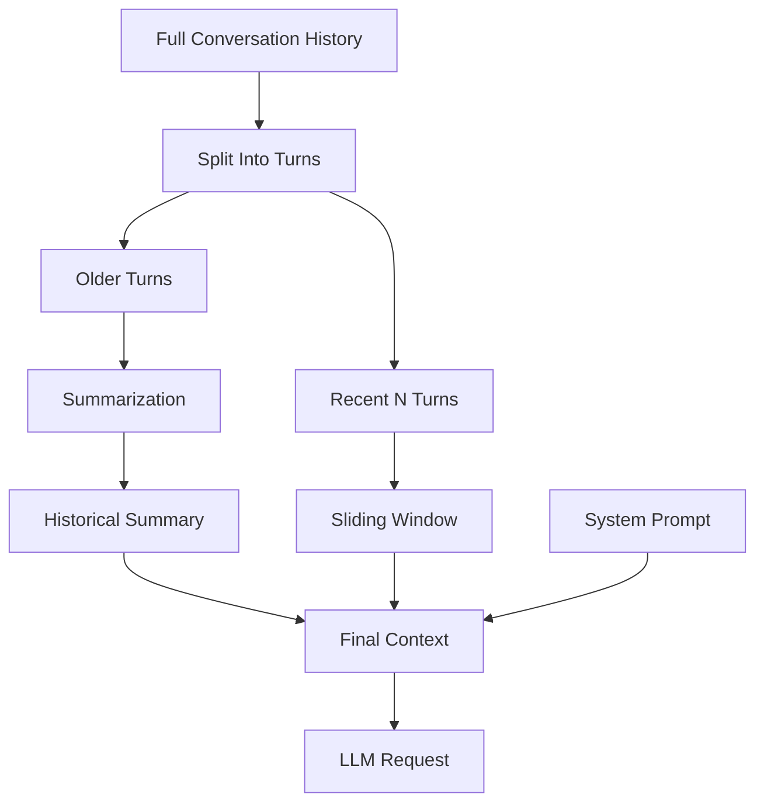

# Forge

> An AI-powered agent built for efficient, long-running conversations with intelligent context management.

## Overview

Forge is an AI agent designed to maintain conversational continuity while keeping token usage predictable and cost-efficient. It combines a sliding context window with automatic summarization to support extended interactions without exceeding model context limits.

## Features

- Sliding Window Context Management
- Automatic Conversation Summarization
- Token-Efficient Prompt Construction
- Long-Running Session Support
- Lightweight Architecture
- Configurable Context Window Size

## Architecture



## Getting Started

### Clone the Repository

```bash
git clone https://github.com/yourusername/forge.git
cd forge
```

### Create a Virtual Environment

```bash
uv venv
```

Activate it:

```bash
# Linux/macOS
source .venv/bin/activate

# Windows
.venv\Scripts\activate
```

### Install Dependencies

```bash
uv sync
```

### Configure Environment Variables

Create a `.env` file:

```env
OPENAI_API_KEY=your_api_key
```

### Run Forge

```bash
python main.py
```

## Context Management

Long-running AI conversations present a fundamental challenge: as chat history grows, token usage increases, costs rise, and context limits are eventually reached.

Forge uses a lightweight **Sliding Window + Summarization** strategy to maintain conversational continuity while keeping token usage predictable.

### How It Works

1. Split conversation history into logical turns.
2. Retain only the most recent `N` turns.
3. Summarize older turns using the LLM.
4. Construct the final context:

```text
[System Prompt]
+ [Historical Summary]
+ [Recent N Turns]
```

### Benefits

- Predictable token usage
- Lower inference costs
- Faster prompt construction
- Reduced context overflow risk
- No external memory infrastructure

## Project Structure

```text
forge/
├── src/
├── main.py
├── requirements.txt
├── pyproject.toml
├── .env
└── README.md
```

## Roadmap

- [ ] Retrieval-Augmented Memory
- [ ] Vector Database Integration
- [ ] Multi-Agent Support
- [ ] Tool Calling Framework
- [ ] Persistent Long-Term Memory

## Contributing

Contributions are welcome. Please open an issue or submit a pull request.

## License

MIT License
